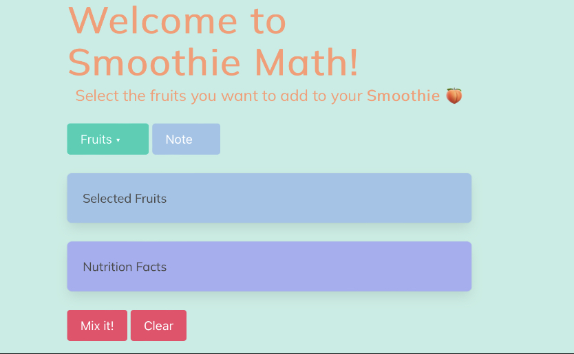

# smoothie-math

<h3 align="center">Smoothie-Math</h3>

  

    A nutrition website that counts each nutrtional component within a customizable smoothie and adds them together to provide a nutritional breakdown of the finished product.
     
     
     
 
  

<!-- ABOUT THE PROJECT -->
## About The Project

Smoothie-Math is a nutrition tool that uses NutritionIX API's extensive food database to provide accurate nutrition numbers for each smoothie created.

### Built With

<!-- USAGE EXAMPLES -->
## How to  use

     
* To create your personalized smoothie, first select the "Fruits" button
* Next make your choices from the list of fruit
* Once you have selected your chosen fruit click "Mix it!"
* You should now see the nutrition totals listed
* If you are interested in another smoothie or want to start over, click "Clear"
* You can also refresh the page and your fruits/nutrition values will stay saved to the page

(<a href="#readme-top">back to top</a>)

<!-- Installation -->
## Installation
* There is no installation needed. Just visit https://allenmurfee.github.io/smoothie-math/ to start using Smoothie Math.  

<!-- CONTRIBUTING -->
## Contributing

* Allen Murfee
* Bernie Migo
* Jack Michie
* Rory O'Donnell

<!-- LICENSE -->
## License

Distributed under the MIT License. See `LICENSE.txt` for more information.

